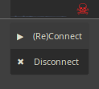

# [Awesomewm](https://awesomewm.org/) Widget for [Mullvad VPN](https://mullvad.net/en)

[Awesomewm-Mullvad VPN Widget](https://github.com/pivaldi/awesomewm-mullvad) is an
[Awesomewm](https://awesomewm.org/) widget to monitor the current
[Mullvad VPN](https://mullvad.net/en) connection status and provides a
simple menu to (re)connect and disconnect the VPN.

The widget in action :

1. Real-time status connection with a **tooltip on mouse hover** (connection up)
1. Real-time status connection with connection down
1. Menu to Connect/Disconnect accessible **clicking in the widget**
   <p align="center">
       
   </p>

## Customization

It is possible to customize the widget by providing a table with all or
some of the following config parameters :

| Name | Default | Description |
|------|---------|-------------|
| connect_options | "--wait" |  |
| timeout | 10 | The refresh timeout |
| format_ok | `'<span color="#22FF22">⚛</span>'` | The markup format to use when connection is up |
| format_ko | `'<span color="#FF2222">☠</span>'` | The markup format to use when connection is down |
| font | `beautiful.font` | The font to use in the widget bar/tooltip |
| cli_path | "/usr/bin/mullvad" | `mullvad` command path. |

## Usage

```lua
local mullvad_widget = require("awesomewm-mullvad.widget")

…

    -- Add widgets to the wibox
    s.mywibox:setup {
      layout = wibox.layout.align.horizontal,
      { -- Left widgets
…
      },
      s.mytasklist, -- Middle widget
      { -- Right widgets
        layout = wibox.layout.fixed.horizontal,
 …
          mullvad_widget({}),
…
```

